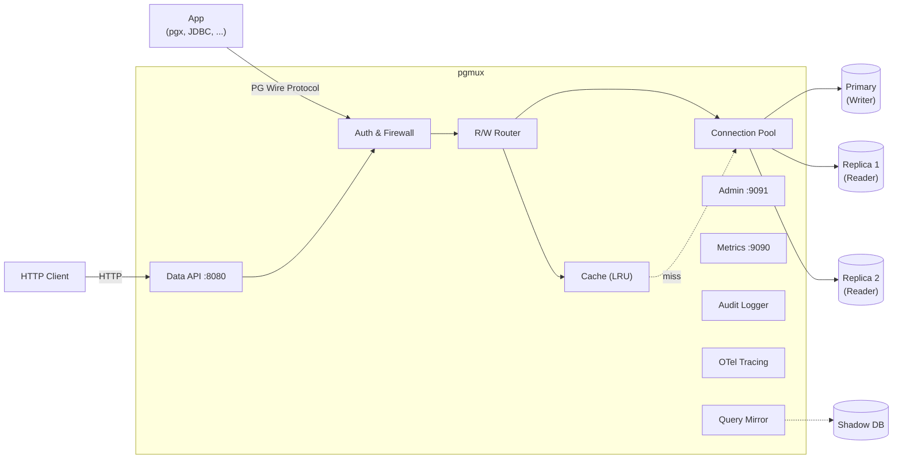

**한국어** | [English](README_en.md)

# pgmux

[](https://github.com/jyukki97/pgmux/actions/workflows/ci.yml)

Go로 작성한 경량 PostgreSQL 프록시. 애플리케이션과 데이터베이스 사이에서 커넥션 풀링, 읽기/쓰기 쿼리 자동 분산, 반복 쿼리 캐싱을 수행합니다. 기존 PostgreSQL 드라이버를 그대로 사용할 수 있습니다.

## 주요 기능

- **트랜잭션 레벨 커넥션 풀링** — Writer/Reader 모두 커넥션 풀에서 관리합니다. 트랜잭션 시작 시 커넥션을 획득하고 종료 시 반환하여, 수천 클라이언트가 소수의 백엔드 커넥션을 공유합니다. 커넥션 반환 시 `DISCARD ALL`로 세션 상태를 초기화합니다.
- **읽기/쓰기 자동 라우팅** — `SELECT`는 Reader(Replica)로, 쓰기 쿼리(`INSERT`, `UPDATE`, `DELETE`, DDL)는 Writer(Primary)로 자동 분산합니다. Reader 간 라운드로빈 로드밸런싱을 지원합니다.
- **쿼리 캐싱** — 반복되는 `SELECT` 쿼리 결과를 인메모리 LRU 캐시에 저장합니다. TTL 만료 및 쓰기 시 테이블 단위 자동 무효화를 지원하며, Redis Pub/Sub을 통해 다중 프록시 인스턴스 간 캐시 무효화를 전파합니다.
- **Prepared Statement 라우팅** — Extended Query Protocol을 지원하여 `SELECT` Prepared Statement도 Reader로 라우팅합니다.
- **Prepared Statement Multiplexing** — `multiplex` 모드에서는 Prepared Statement의 Parse/Bind를 프록시가 인터셉트하여 파라미터를 안전하게 바인딩한 Simple Query로 합성합니다. Transaction Pooling 환경에서도 Prepared Statement를 사용할 수 있는 킬러 피처입니다 (PgBouncer에서는 불가능). SQL Injection 방어를 위한 타입별 리터럴 직렬화를 내장하고 있습니다.
- **Replication Lag 대응** — `read_after_write_delay` 타이머 기반 또는 LSN 기반 Causal Consistency를 선택할 수 있습니다. LSN 모드에서는 쓰기 후 Writer의 WAL LSN을 추적하여, 해당 LSN에 도달한 Reader에서만 읽기를 수행합니다.
- **AST 기반 쿼리 분류** — pg_query_go(PostgreSQL 실제 파서)를 활용하여 CTE, 서브쿼리, DDL 등 복잡한 쿼리도 정확하게 읽기/쓰기를 분류합니다. 기존 문자열 파서와 설정으로 전환 가능합니다.
- **쿼리 방화벽(Firewall)** — AST 분석으로 조건 없는 DELETE/UPDATE, DROP TABLE, TRUNCATE 등 위험 쿼리를 사전 차단합니다.
- **시맨틱 캐시 키** — 공백, 대소문자가 달라도 구조적으로 동일한 쿼리는 같은 캐시 키를 생성하여 캐시 히트율을 높입니다. 리터럴 값이 다르면 별도의 캐시 엔트리를 유지합니다.
- **힌트 기반 라우팅** — SQL 주석으로 라우팅을 강제할 수 있습니다: `/* route:writer */ SELECT ...`
- **트랜잭션 인식** — `BEGIN` ~ `COMMIT`/`ROLLBACK` 내부의 모든 쿼리는 Writer로 전송됩니다.
- **Prometheus 메트릭** — 풀, 라우팅, 캐시 메트릭을 `/metrics` 엔드포인트로 노출합니다.
- **Admin API** — HTTP를 통해 런타임 통계 조회, 헬스체크, 캐시 플러시를 수행할 수 있습니다.
- **Serverless Data API** — `POST /v1/query`로 HTTP를 통해 SQL을 실행하고 JSON 응답을 받습니다. Lambda/Edge 함수에서 TCP 커넥션 비용 없이 풀링된 커넥션을 재활용합니다. API Key 인증, 방화벽, 캐싱이 투명하게 적용됩니다.
- **Audit Logging & Slow Query Tracker** — 모든 쿼리 또는 느린 쿼리만 선별하여 구조화 감사 로그를 기록합니다. 임계값 초과 시 Slack 등 Webhook으로 알림을 전송하며, 동일 쿼리 중복 알림을 자동으로 억제합니다.
- **Query Mirroring** — 프로덕션 쿼리를 Shadow DB에 비동기로 미러링하여 지연 시간을 비교합니다. 쿼리 패턴별 P50/P99 레이턴시 비교, 자동 성능 회귀 감지, 테이블 필터, read_only/all 모드를 지원합니다. 프로덕션 트래픽에 영향 없이 DB 마이그레이션·인덱스 변경의 성능 영향을 사전 검증할 수 있습니다.
- **Query Digest / Top-N Queries** — 쿼리를 정규화(`$N` 치환)하여 패턴별 실행 횟수, 평균/P50/P99 레이턴시를 집계합니다. `GET /admin/queries/top`으로 가장 많이 실행된 쿼리 패턴을 확인하고, `POST /admin/queries/reset`으로 통계를 초기화할 수 있습니다. `pg_stat_statements`의 프록시 버전입니다.
- **Multi-Database Routing** — 단일 프록시 인스턴스에서 여러 PostgreSQL 데이터베이스를 동시 프록시합니다. 클라이언트의 `StartupMessage.database` 필드로 DB 그룹을 자동 분기하며, 각 DB별로 독립적인 Writer/Reader 풀, 밸런서, Circuit Breaker를 유지합니다. 기존 단일 DB 설정은 변경 없이 하위호환됩니다.
- **OpenTelemetry 분산 추적** — 쿼리 파싱, 캐시 조회, 커넥션 풀 획득, 백엔드 실행까지 각 단계를 스팬으로 추적합니다. OTLP gRPC 또는 stdout 익스포터를 지원하며, Data API의 `traceparent` 헤더를 통한 컨텍스트 전파로 애플리케이션에서 DB까지 엔드투엔드 트레이싱이 가능합니다.
- **PostgreSQL Wire Protocol 직접 구현** — PG 프로토콜을 직접 처리(MD5 & SCRAM-SHA-256 인증)하므로, 어떤 표준 PG 드라이버든 수정 없이 연결할 수 있습니다.

## 아키텍처



## 빠른 시작

### 사전 요구사항

- Go 1.25+
- PostgreSQL 16+ (Primary + Replica)
- Docker & Docker Compose (로컬 개발용)

### 빌드

```bash
make build
```

### Docker로 로컬 실행

Primary 1대 + Replica 2대 PostgreSQL 인스턴스를 실행합니다:

```bash
make docker-up
```

`config.yaml`을 Docker 인스턴스에 맞게 수정한 뒤 프록시를 실행합니다:

```bash
make run
```

### 접속

프록시는 완전히 투명하게 동작하므로, 어떤 PostgreSQL 클라이언트든 그대로 사용할 수 있습니다:

```bash
psql -h 127.0.0.1 -p 5432 -U postgres -d testdb
```

## 설정

프로젝트 루트에 `config.yaml`을 작성합니다:

```yaml
proxy:
  listen: "0.0.0.0:5432"
  shutdown_timeout: 30s              # Graceful shutdown 타임아웃 (기본: 30s)

writer:
  host: "primary.db.internal"
  port: 5432

readers:                              # 선택사항 — 생략 시 모든 쿼리가 writer로 라우팅
  - host: "replica-1.db.internal"
    port: 5432
  - host: "replica-2.db.internal"
    port: 5432

pool:
  min_connections: 5
  max_connections: 50
  idle_timeout: 10m
  max_lifetime: 1h
  connection_timeout: 5s
  reset_query: "DISCARD ALL"    # 커넥션 반환 시 세션 리셋 쿼리
  prepared_statement_mode: "proxy" # "proxy" (기본, 패스스루) | "multiplex" (Simple Query로 합성)

routing:
  read_after_write_delay: 500ms  # 타이머 기반 (causal_consistency와 양자택일)
  causal_consistency: false       # true: LSN 기반 Causal Consistency (read_after_write_delay 무시)
  ast_parser: false               # true: pg_query_go AST 파서 사용 (정확도↑, 성능 약간↓)

firewall:
  enabled: true
  block_delete_without_where: true
  block_update_without_where: true
  block_drop_table: false
  block_truncate: false

cache:
  enabled: true
  cache_ttl: 10s
  max_cache_entries: 10000
  max_result_size: "1MB"
  invalidation:
    mode: "pubsub"          # "local" (기본값) 또는 "pubsub" (Redis)
    redis_addr: "localhost:6379"
    channel: "pgmux:invalidate"

audit:
  enabled: true
  slow_query_threshold: 500ms    # 이 이상이면 slow query로 기록
  log_all_queries: false          # true면 모든 쿼리 감사 로그
  webhook:
    enabled: false
    url: "https://hooks.slack.com/services/..."
    timeout: 5s

mirror:
  enabled: false
  host: "shadow-db.internal"
  port: 5432
  # user, password, database: 미설정 시 backend 값 사용
  mode: "read_only"               # "read_only" (기본) | "all"
  tables: []                       # 빈 배열 = 모든 테이블
  compare: true                    # 패턴별 P50/P99 레이턴시 비교
  workers: 4                       # 미러링 워커 수
  buffer_size: 10000               # 비동기 큐 크기 (초과 시 드롭)

digest:
  enabled: true
  max_patterns: 1000               # 추적할 최대 고유 쿼리 패턴 수
  samples_per_pattern: 1000        # 패턴별 P50/P99 계산용 샘플 수

backend:
  user: "postgres"
  password: "postgres"
  database: "testdb"

# --- Multi-Database 설정 (선택사항) ---
# databases가 있으면 위의 writer/readers/backend는 무시됩니다.
# databases:
#   mydb:
#     writer:
#       host: "primary-1.db.internal"
#       port: 5432
#     readers:
#       - host: "replica-1a.db.internal"
#         port: 5432
#     backend:
#       user: "postgres"
#       password: "secret"
#       database: "mydb"
#   otherdb:
#     writer:
#       host: "primary-2.db.internal"
#       port: 5432
#     backend:
#       user: "admin"
#       password: "secret"
#       database: "otherdb"

metrics:
  enabled: true
  listen: "0.0.0.0:9090"

admin:
  enabled: true
  listen: "0.0.0.0:9091"

data_api:
  enabled: false
  listen: "0.0.0.0:8080"
  api_keys:
    - "your-secret-key"

telemetry:
  enabled: false
  exporter: "otlp"            # "otlp" (gRPC) 또는 "stdout"
  endpoint: "localhost:4317"   # OTLP Collector gRPC 엔드포인트
  service_name: "pgmux"
  sample_ratio: 1.0            # 0.0 ~ 1.0 (샘플링 비율)
```

## Makefile 명령어

| 명령어 | 설명 |
|--------|------|
| `make build` | `bin/pgmux` 바이너리 빌드 |
| `make run` | 빌드 후 실행 |
| `make test` | 전체 단위 테스트 실행 |
| `make test-integration` | E2E 통합 테스트 실행 |
| `make test-coverage` | 테스트 커버리지 리포트 생성 |
| `make bench` | 벤치마크 실행 |
| `make lint` | golangci-lint 실행 |
| `make docker-up` | 로컬 PostgreSQL Primary + Replica 실행 |
| `make docker-down` | Docker 컨테이너 정리 |
| `make clean` | 빌드 산출물 삭제 |

## 프로젝트 구조

```
cmd/pgmux/main.go              # 진입점
internal/
  config/config.go                # YAML 설정 파싱
  config/watcher.go               # 설정 파일 변경 감시 (fsnotify, ConfigMap symlink swap)
  proxy/server.go                 # Server 구조체, NewServer, Start, handleConn, Reload
  proxy/dbgroup.go                # DatabaseGroup (per-DB 풀, 밸런서, CB 캡슐화)
  proxy/auth.go                   # 인증 핸드셰이크 (relayAuth, frontendAuth)
  proxy/query.go                  # 메인 쿼리 루프 (relayQueries)
  proxy/query_read.go             # 읽기 쿼리 처리 (캐시 + fallback)
  proxy/query_extended.go         # 확장 쿼리 프로토콜 (Prepared Statement 라우팅)
  proxy/copy.go                   # COPY IN/OUT/BOTH 릴레이
  proxy/backend.go                # 백엔드 커넥션 관리 (acquire, reset, fallback)
  proxy/lsn.go                    # LSN 폴링 (Causal Consistency)
  proxy/helpers.go                # 유틸리티 (sendError, parseSize, emitAuditEvent)
  proxy/pgconn.go                 # PG 인증 (MD5, SCRAM-SHA-256)
  proxy/synthesizer.go            # Prepared Statement → Simple Query 합성 (Multiplexing)
  proxy/cancel.go                 # CancelRequest 프로토콜 처리
  pool/pool.go                    # 커넥션 풀 + 헬스체크
  router/router.go                # 쓰기/읽기 라우팅 결정 (Causal Consistency)
  router/parser.go                # 문자열 기반 쿼리 분류
  router/parser_ast.go            # AST 기반 쿼리 분류 (pg_query_go)
  router/ast.go                   # SQL AST 파싱 + 노드 순회
  router/balancer.go              # 라운드로빈 로드밸런서 + LSN-aware 라우팅
  router/lsn.go                   # PostgreSQL LSN 타입 파싱/비교
  router/firewall.go              # 쿼리 방화벽 (위험 쿼리 차단)
  audit/audit.go                  # Audit Logging + Slow Query Tracker
  dataapi/handler.go              # Serverless Data API (HTTP → PG)
  cache/cache.go                  # LRU 캐시 + 테이블별 무효화
  cache/invalidator.go            # Redis Pub/Sub 캐시 무효화 전파
  cache/normalize.go              # 시맨틱 캐시 키 (AST Parse+Deparse)
  protocol/message.go             # PG 와이어 프로토콜 메시지 파싱
  protocol/literal.go             # PG 타입별 SQL 리터럴 직렬화 (Injection 방어)
  resilience/ratelimit.go         # Token Bucket Rate Limiter
  resilience/breaker.go           # Circuit Breaker (Closed/Open/Half-Open)
  metrics/metrics.go              # Prometheus 메트릭
  telemetry/telemetry.go          # OpenTelemetry 분산 추적
  mirror/mirror.go                # Query Mirroring (Shadow DB 비동기 전송)
  mirror/stats.go                 # 패턴별 P50/P99 레이턴시 비교 통계
  digest/digest.go                # Query Digest (Top-N 쿼리 패턴 통계)
  admin/admin.go                  # Admin HTTP API
tests/
  e2e_test.go                     # Docker 기반 E2E 테스트
  integration_test.go             # 통합 테스트
  benchmark_test.go               # 벤치마크
Dockerfile                        # Multi-stage 빌드
deploy/grafana/                   # Grafana 대시보드 JSON 템플릿
deploy/helm/pgmux/             # Kubernetes Helm Chart
```

## Admin API

| 엔드포인트 | 메서드 | 설명 |
|-----------|--------|------|
| `/admin/stats` | GET | 풀, 캐시, 라우팅 통계 |
| `/admin/health` | GET | 백엔드 헬스 상태 (Writer + Reader별) |
| `/admin/config` | GET | 현재 적용된 설정 (비밀번호 마스킹) |
| `/admin/cache/flush` | POST | 전체 캐시 플러시 |
| `/admin/cache/flush/{table}` | POST | 특정 테이블 캐시 무효화 |
| `/admin/reload` | POST | 설정 핫 리로드 |
| `/admin/mirror/stats` | GET | 쿼리 미러링 통계 (패턴별 P50/P99, 회귀 감지) |
| `/admin/queries/top` | GET | Query Digest Top-N (패턴별 실행 횟수, 평균/P50/P99 레이턴시) |
| `/admin/queries/reset` | POST | Query Digest 통계 초기화 |

## 메트릭

`metrics.enabled`가 `true`일 때, 설정된 주소에서 Prometheus 메트릭을 수집할 수 있습니다:

- `pgmux_pool_connections_open` — 역할별 열린 커넥션 수
- `pgmux_pool_connections_idle` — 유휴 커넥션 수
- `pgmux_pool_acquires_total` — 커넥션 획득 횟수
- `pgmux_pool_acquire_duration_seconds` — 커넥션 획득 레이턴시
- `pgmux_queries_routed_total` — 라우팅된 쿼리 수 (writer/reader)
- `pgmux_query_duration_seconds` — 쿼리 처리 레이턴시
- `pgmux_reader_fallback_total` — Reader 장애 시 Writer 폴백 횟수
- `pgmux_cache_hits_total` / `pgmux_cache_misses_total` — 캐시 히트/미스
- `pgmux_cache_entries` — 현재 캐시 항목 수
- `pgmux_cache_invalidations_total` — 캐시 무효화 횟수
- `pgmux_reader_lsn_lag_bytes` — Reader별 WAL replay LSN (Causal Consistency 활성 시)
- `pgmux_firewall_blocked_total` — 방화벽 차단 횟수 (rule별)
- `pgmux_slow_queries_total` — Slow Query 감지 횟수 (target별)
- `pgmux_audit_webhook_sent_total` — Audit Webhook 전송 횟수
- `pgmux_audit_webhook_errors_total` — Audit Webhook 실패 횟수
- `pgmux_digest_patterns` — 현재 Query Digest 고유 패턴 수

## Data API (HTTP)

TCP 커넥션 없이 HTTP로 SQL 쿼리를 실행할 수 있습니다:

```bash
curl -X POST http://localhost:8080/v1/query \
  -H "Authorization: Bearer your-api-key" \
  -H "Content-Type: application/json" \
  -d '{"sql": "SELECT id, name FROM users LIMIT 2"}'
```

응답:
```json
{
  "columns": ["id", "name"],
  "types": ["int4", "text"],
  "rows": [[1, "Alice"], [2, "Bob"]],
  "row_count": 2,
  "command": "SELECT 2"
}
```

R/W 라우팅, 캐싱, 방화벽, Rate Limiting이 투명하게 적용됩니다.

## Grafana Dashboard

`deploy/grafana/pgmux-overview.json`에 Prometheus 데이터소스 기반 Grafana 대시보드 템플릿을 제공합니다.

### 대시보드 구성

| 섹션 | 패널 | 주요 메트릭 |
|------|------|------------|
| **Overview** | Total QPS, Avg Latency, Cache Hit Rate, Open Connections | 운영 핵심 지표 한눈에 |
| **Query Routing** | QPS by Target, Duration P50/P99, Reader Fallback | Writer/Reader 부하 분산 확인 |
| **Connection Pool** | Open/Idle Connections, Acquire Duration, Acquires/sec | 풀 포화도 모니터링 |
| **Cache** | Hits/Misses, Hit Rate Gauge, Entries & Invalidations | 캐시 효율 추적 |
| **Security** | Firewall Blocked, Rate Limited | 차단/제한 현황 |
| **Replication** | LSN Lag (bytes) per Reader | Replica 지연 감시 |
| **Audit** | Slow Queries, Webhook Sent/Errors | 느린 쿼리 추세 |
| **Query Digest** | Unique Patterns | 쿼리 다양성 추이 |

### 설치 방법

**Grafana UI에서 Import:**

1. Grafana → Dashboards → Import
2. `deploy/grafana/pgmux-overview.json` 파일 업로드
3. Prometheus 데이터소스 선택 → Import

**Helm Chart (Grafana Sidecar):**

```bash
helm install pgmux deploy/helm/pgmux/ \
  --set grafanaDashboard.enabled=true
```

`grafana_dashboard: "1"` 라벨이 적용된 ConfigMap이 생성되어 Grafana sidecar가 자동으로 대시보드를 로드합니다.

## Kubernetes 배포 (Helm)

### Docker 이미지 빌드

```bash
make docker-build
```

### Helm Chart 설치

```bash
# values.yaml에서 writer/readers 주소를 실제 DB로 수정한 뒤:
helm install pgmux deploy/helm/pgmux/ \
  --set config.writer.host=primary.db.internal \
  --set config.backend.password=mypassword
```

### 주요 values

| 키 | 기본값 | 설명 |
|---|---|---|
| `replicaCount` | 2 | 프록시 Pod 수 |
| `config.*` | (config.yaml 전체) | pgmux 설정 |
| `autoscaling.enabled` | false | HPA 활성화 |
| `podDisruptionBudget.enabled` | true | PDB 활성화 |
| `serviceMonitor.enabled` | false | Prometheus Operator ServiceMonitor |
| `grafanaDashboard.enabled` | false | Grafana sidecar용 대시보드 ConfigMap |

## 라이선스

이 프로젝트는 [MIT 라이선스](LICENSE)를 따릅니다.
