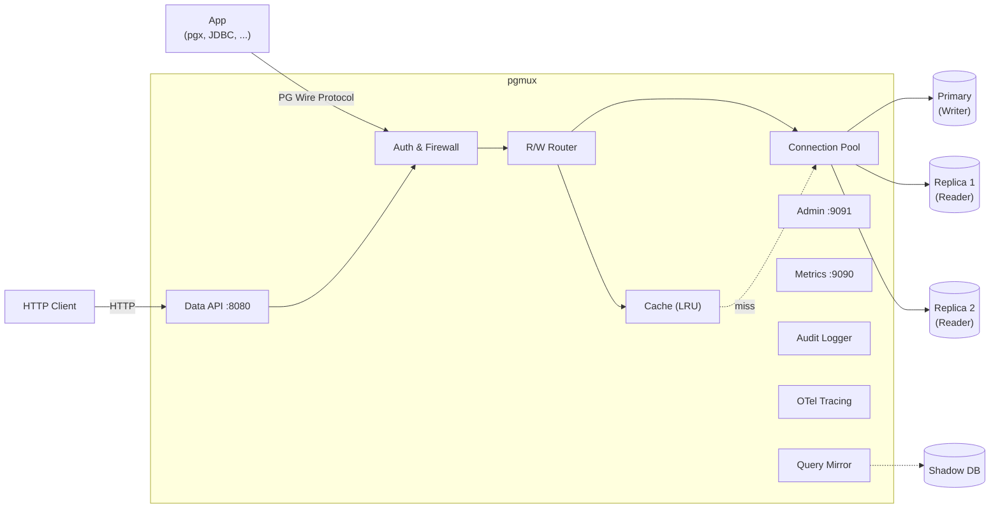

[한국어](README.md) | **English**

# pgmux

[](https://github.com/jyukki97/pgmux/actions/workflows/ci.yml)
[](https://github.com/jyukki97/pgmux/releases/latest)
[](https://go.dev/)
[](LICENSE)
[](https://goreportcard.com/report/github.com/jyukki97/pgmux)
[](https://github.com/jyukki97/pgmux/pkgs/container/pgmux)

A lightweight PostgreSQL proxy written in Go. Sitting between your application and database, it provides connection pooling, automatic read/write query routing, and repeated query caching. Works with any existing PostgreSQL driver without modification.

## Key Features

- **Transaction-Level Connection Pooling** -- Both Writer and Reader connections are managed by connection pools. A connection is acquired when a transaction begins and released when it ends, allowing thousands of clients to share a small number of backend connections. Session state is reset with `DISCARD ALL` upon connection release.
- **Automatic Read/Write Routing** -- `SELECT` queries are routed to Readers (Replicas), while write queries (`INSERT`, `UPDATE`, `DELETE`, `MERGE`, `CALL`, `COMMENT`, DDL) are routed to the Writer (Primary). `EXPLAIN ANALYZE` with write sub-queries is also routed to Writer. Round-robin load balancing across Readers is supported.
- **Query Caching** -- Results of repeated `SELECT` queries are stored in an in-memory LRU cache. Supports TTL expiration and automatic table-level invalidation on writes. Cache invalidation propagates across multiple proxy instances via Redis Pub/Sub. **Note:** `CALL` (Stored Procedures) are routed to Writer but cannot automatically invalidate cache because the tables modified inside the procedure are not statically determinable. Manual invalidation via Admin API (`/admin/cache/flush`) is recommended when procedures modify data.
- **Prepared Statement Routing** -- Supports the Extended Query Protocol, routing `SELECT` Prepared Statements to Readers.
- **Prepared Statement Multiplexing** -- In `multiplex` mode, the proxy intercepts Prepared Statement Parse/Bind and synthesizes them into Simple Queries with safely bound parameters. This is a killer feature that enables Prepared Statements in Transaction Pooling environments (impossible with PgBouncer). Includes built-in type-specific literal serialization for SQL Injection defense.
- **Replication Lag Handling** -- Choose between timer-based `read_after_write_delay` or LSN-based Causal Consistency. In LSN mode, after a write, the Writer's WAL LSN is tracked, and reads are only served from Readers that have replayed up to that LSN.
- **AST-Based Query Classification** -- Uses pg_query_go (the actual PostgreSQL parser) to accurately classify complex queries including CTEs, subqueries, and DDL as read or write. Can be switched to the legacy string-based parser via configuration.
- **Query Firewall** -- Blocks dangerous queries such as DELETE/UPDATE without WHERE clauses, DROP TABLE, and TRUNCATE through AST analysis.
- **Semantic Cache Keys** -- Structurally identical queries produce the same cache key regardless of whitespace or case differences, improving cache hit rates. Queries with different literal values maintain separate cache entries.
- **Hint-Based Routing** -- Force routing via SQL comments: `/* route:writer */ SELECT ...`
- **Transaction Awareness** -- All queries within `BEGIN` ~ `COMMIT`/`ROLLBACK`/`ABORT` are sent to the Writer.
- **Prometheus Metrics** -- Exposes pool, routing, and cache metrics at the `/metrics` endpoint.
- **Admin API** -- Provides runtime statistics, health checks, and cache flush operations via HTTP. Supports Bearer API Key authentication with RBAC (admin/viewer role separation) and optional IP allowlist. Settings are hot-reloadable.
- **Serverless Data API** -- Execute SQL via HTTP with `POST /v1/query` and receive JSON responses. Reuse pooled connections from Lambda/Edge functions without TCP connection overhead. API Key authentication, firewall, and caching are applied transparently. `COPY` statements are not supported due to the streaming nature of HTTP.
- **Audit Logging & Slow Query Tracker** -- Records structured audit logs for all queries or only slow queries. Sends alerts via Webhook (e.g., Slack) when thresholds are exceeded, with automatic deduplication of alerts for the same query.
- **SQL Redaction / Safe Observability** -- Automatically masks SQL literals across all external-facing surfaces: audit logs, OpenTelemetry spans, slog, and webhooks. Configure `observability.sql_redaction` with three policies: `none` (pass-through), `literals` (replace literals with `$1`, `$2`, default), or `full` (expose only query fingerprint hash). Uses `pg_query` parser for accurate literal removal with regex fallback on parse failure. Internal routing and caching use raw SQL, so functionality is unaffected.
- **Query Mirroring** -- Asynchronously mirrors production queries to a Shadow DB for latency comparison. Supports per-pattern P50/P99 latency comparison, automatic performance regression detection, table filtering, and read_only/all modes. Validate the performance impact of DB migrations and index changes without affecting production traffic.
- **Query Digest / Top-N Queries** -- Normalizes queries (replacing literals with `$N`) and aggregates per-pattern execution counts, average/P50/P99 latency. View the most frequently executed query patterns via `GET /admin/queries/top`, and reset statistics with `POST /admin/queries/reset`. A proxy-level equivalent of `pg_stat_statements`.
- **Query Timeout** -- Proxy-level query timeout. Sends a `CancelRequest` to the backend when the configured timeout is exceeded. Set globally via `pool.query_timeout: 30s` or per-query via `/* timeout:5s */ SELECT ...` hint.
- **Idle Client Timeout** -- Automatically disconnects idle clients. With `proxy.client_idle_timeout: 5m`, clients that send no queries for 5 minutes receive a FATAL error (57P01) and are disconnected. Timeout is not applied during active transactions. Hot-reloadable.
- **Online Maintenance Mode** -- Instantly enable/disable maintenance mode via Admin API. In maintenance mode, new connections and non-transactional queries are rejected while in-progress transactions are allowed to complete (drain). `/readyz` automatically returns 503 so LB/K8s stops routing traffic. Use for safe traffic blocking during deployments, migrations, and patches.
- **Session Compatibility Guard** -- Detects session-dependent SQL features (LISTEN/UNLISTEN, session SET, DECLARE CURSOR, CREATE TEMP, PREPARE, advisory locks) that are incompatible with transaction pooling. `SET LOCAL`, `SET TRANSACTION`, and `SET CONSTRAINTS` are excluded as they are transaction-scoped. Configurable modes: `block` (reject), `warn` (log + allow), `pin` (bind session to writer for its lifetime), or `allow` (no-op). String-based and AST-based hybrid detection.
- **Read-Only Mode** -- `POST /admin/readonly` rejects all write queries at the proxy level. Maintains read service availability while blocking data modifications during writer failures, emergency maintenance, or data protection scenarios. Disable with `DELETE /admin/readonly`.
- **Per-User / Per-Database Connection Limits** -- Limit the maximum number of connections per user and per database. Prevents a single user from monopolizing the pool in multi-tenant environments. Rejects with PostgreSQL standard error code (53300, `too_many_connections`). Limits can be hot-reloaded and monitored via `GET /admin/connections`.
- **Multi-Database Routing** -- Route multiple PostgreSQL databases simultaneously from a single proxy instance. Automatically routes to the correct DB group based on the client's `StartupMessage.database` field, maintaining independent Writer/Reader pools, balancers, and Circuit Breakers per database.
- **OpenTelemetry Distributed Tracing** -- Traces each stage as spans: query parsing, cache lookup, connection pool acquisition, and backend execution. Supports OTLP gRPC or stdout exporters. End-to-end tracing from application to DB is possible through context propagation via the Data API's `traceparent` header.
- **Direct PostgreSQL Wire Protocol Implementation** -- Handles the PG protocol directly (MD5 & SCRAM-SHA-256 authentication), so any standard PG driver can connect without modification.

## Architecture



## Performance Benchmark

Measured with pgbench (PostgreSQL standard benchmark tool): Direct DB vs pgmux vs PgBouncer. 3-round average, warmed up before measurement.

**SELECT-only (read-only workload)**

| Target | c=1 | c=10 | c=50 | c=100 |
|--------|-----|------|------|-------|
| Direct | 2,447 | 16,724 | 25,483 | 25,488 |
| **pgmux** | **2,467** | **14,482** | **21,069** | **20,137** |
| PgBouncer | 2,178 | 13,812 | 23,665 | 21,778 |

**TPC-B (mixed read/write workload)**

| Target | c=1 | c=10 | c=50 | c=100 |
|--------|-----|------|------|-------|
| Direct | 413 | 2,282 | 3,306 | 3,156 |
| **pgmux** | **337** | **1,906** | **2,606** | **2,578** |
| PgBouncer | 370 | 2,070 | 2,757 | 2,745 |

> **At c=1, pgmux (2,467) outperforms both Direct (2,447) and PgBouncer (2,178)** — connection pooling works with zero overhead. At high-concurrency SELECT, PgBouncer benefits from its C single-threaded event loop (Go goroutine scheduling overhead), but pgmux offers caching, firewall, mirroring, Prepared Statement Multiplexing, and other features PgBouncer lacks.
>
> Reproduce: `make bench-compare`

## Quick Start

### Prerequisites

- Go 1.25+
- PostgreSQL 16+ (Primary + Replica)
- Docker & Docker Compose (for local development)

### Build

```bash
make build
```

### Run Locally with Docker

Start a PostgreSQL instance with 1 Primary + 2 Replicas:

```bash
make docker-up
```

Edit `config.yaml` to match the Docker instances, then start the proxy:

```bash
make run
```

### Connect

The proxy operates completely transparently, so any PostgreSQL client can connect as-is:

```bash
psql -h 127.0.0.1 -p 5432 -U postgres -d testdb
```

## Configuration

Create a `config.yaml` in the project root:

```yaml
proxy:
  listen: "0.0.0.0:5432"
  shutdown_timeout: 30s              # Graceful shutdown timeout (default: 30s)
  client_idle_timeout: 0             # Idle client timeout (0 = disabled, e.g., 5m)

pool:
  min_connections: 5
  max_connections: 50
  idle_timeout: 10m
  max_lifetime: 1h
  connection_timeout: 5s
  query_timeout: 0              # Query timeout (0 = unlimited). Per-query hint: /* timeout:5s */
  reset_query: "DISCARD ALL"    # Session reset query on connection release
  prepared_statement_mode: "proxy" # "proxy" (default, passthrough) | "multiplex" (synthesize Simple Query)

routing:
  read_after_write_delay: 500ms  # Timer-based (mutually exclusive with causal_consistency)
  causal_consistency: false       # true: LSN-based Causal Consistency (overrides read_after_write_delay)
  ast_parser: false               # true: Use pg_query_go AST parser (higher accuracy, slightly lower performance)

firewall:
  enabled: true
  block_delete_without_where: true
  block_update_without_where: true
  block_drop_table: false
  block_truncate: false

session_compatibility:
  enabled: true
  mode: "warn"                     # "block" | "warn" | "pin" | "allow"

observability:
  sql_redaction: "literals"        # "none" | "literals" | "full"

circuit_breaker:
  enabled: false
  error_threshold: 0.5           # Error rate (0.0-1.0) — trips breaker when exceeded
  open_duration: 10s              # Duration to stay in Open state
  half_open_max: 3                # Max requests allowed in Half-Open state
  window_size: 10                 # Rolling window size for error rate calculation

rate_limit:
  enabled: false
  rate: 1000                      # Queries per second
  burst: 100                      # Max burst size

cache:
  enabled: true
  cache_ttl: 10s
  max_cache_entries: 10000
  max_result_size: "1MB"
  invalidation:
    mode: "pubsub"          # "local" (default) or "pubsub" (Redis)
    redis_addr: "localhost:6379"
    channel: "pgmux:invalidate"

audit:
  enabled: true
  slow_query_threshold: 500ms    # Queries slower than this are logged as slow queries
  log_all_queries: false          # true to log audit records for all queries
  webhook:
    enabled: false
    url: "https://hooks.slack.com/services/..."
    timeout: 5s

mirror:
  enabled: false
  host: "shadow-db.internal"
  port: 5432
  # user, password, database: uses backend values if not set
  mode: "read_only"               # "read_only" (default) | "all"
  tables: []                       # Empty array = all tables
  compare: true                    # Per-pattern P50/P99 latency comparison
  workers: 4                       # Number of mirroring workers
  buffer_size: 10000               # Async queue size (drops when exceeded)

digest:
  enabled: true
  max_patterns: 1000               # Maximum number of unique query patterns to track
  samples_per_pattern: 1000        # Samples per pattern for P50/P99 calculation

databases:
  mydb:
    writer:
      host: "primary.db.internal"
      port: 5432
    readers:
      - host: "replica-1.db.internal"
        port: 5432
      - host: "replica-2.db.internal"
        port: 5432
    backend:
      user: "postgres"
      password: "postgres"
      database: "mydb"
  # otherdb:
  #   writer:
  #     host: "primary-2.db.internal"
  #     port: 5432
  #   backend:
  #     user: "admin"
  #     password: "secret"
  #     database: "otherdb"

backend:                          # Shared defaults -- used when not specified in databases
  user: "postgres"
  password: "postgres"

metrics:
  enabled: true
  listen: "0.0.0.0:9090"

admin:
  enabled: true
  listen: "0.0.0.0:9091"
  auth:
    enabled: true
    api_keys:
      - key: "your-admin-api-key"
        role: "admin"              # Full access (GET + POST)
      - key: "your-viewer-api-key"
        role: "viewer"             # Read-only access (GET only)
    ip_allowlist:                  # Optional -- allowed IP/CIDRs (empty = allow all)
      - "10.0.0.0/8"
      - "172.16.0.0/12"
    trusted_proxies:               # Optional -- reverse proxy IPs/CIDRs that may set X-Forwarded-For (empty = never trust XFF)
      - "10.0.0.1"
      - "172.16.0.0/12"

data_api:
  enabled: false
  listen: "0.0.0.0:8080"
  api_keys:
    - "your-secret-key"

tls:
  enabled: false
  cert_file: "/path/to/server.crt"
  key_file: "/path/to/server.key"

config:
  watch: false                   # true: watch config file changes via fsnotify (hot-reload)

telemetry:
  enabled: false
  exporter: "otlp"            # "otlp" (gRPC) or "stdout"
  endpoint: "localhost:4317"   # OTLP Collector gRPC endpoint
  service_name: "pgmux"
  sample_ratio: 1.0            # 0.0 ~ 1.0 (sampling ratio)
```

## Makefile Commands

| Command | Description |
|---------|-------------|
| `make build` | Build `bin/pgmux` binary |
| `make run` | Build and run |
| `make test` | Run all unit tests |
| `make test-integration` | Run E2E integration tests |
| `make test-coverage` | Generate test coverage report |
| `make bench` | Run component benchmarks |
| `make bench-compare` | Direct/pgmux/PgBouncer comparison benchmark |
| `make lint` | Run golangci-lint |
| `make docker-up` | Start local PostgreSQL Primary + Replica |
| `make docker-down` | Clean up Docker containers |
| `make clean` | Remove build artifacts |

## Project Structure

```
cmd/pgmux/main.go              # Entry point
internal/
  config/config.go                # YAML configuration parsing
  config/watcher.go               # Config file change watcher (fsnotify, ConfigMap symlink swap)
  proxy/server.go                 # Server struct, NewServer, Start, handleConn, Reload
  proxy/dbgroup.go                # DatabaseGroup (per-DB pool, balancer, CB encapsulation)
  proxy/auth.go                   # Authentication handshake (relayAuth, frontendAuth)
  proxy/query.go                  # Main query loop (relayQueries)
  proxy/query_read.go             # Read query handling (cache + fallback)
  proxy/query_extended.go         # Extended Query Protocol (Prepared Statement routing)
  proxy/copy.go                   # COPY IN/OUT/BOTH relay
  proxy/backend.go                # Backend connection management (acquire, reset, fallback)
  proxy/lsn.go                    # LSN polling (Causal Consistency)
  proxy/helpers.go                # Utilities (sendError, parseSize, emitAuditEvent)
  proxy/connlimit.go              # Per-User/Per-DB connection limits (ConnTracker)
  proxy/pgconn.go                 # PG authentication (MD5, SCRAM-SHA-256)
  proxy/synthesizer.go            # Prepared Statement to Simple Query synthesis (Multiplexing)
  proxy/cancel.go                 # CancelRequest protocol handling
  pool/pool.go                    # Connection pool + health check
  router/router.go                # Write/Read routing decisions (Causal Consistency)
  router/parser.go                # String-based query classification
  router/parser_ast.go            # AST-based query classification (pg_query_go)
  router/ast.go                   # SQL AST parsing + node traversal
  router/balancer.go              # Round-robin load balancer + LSN-aware routing
  router/lsn.go                   # PostgreSQL LSN type parsing/comparison
  router/firewall.go              # Query firewall (dangerous query blocking)
  router/session_compat.go        # Session Compatibility Guard (session dependency detection/block/pin)
  redact/redact.go                # SQL Redaction (literal masking, fingerprint)
  audit/audit.go                  # Audit Logging + Slow Query Tracker
  dataapi/handler.go              # Serverless Data API (HTTP to PG)
  cache/cache.go                  # LRU cache + per-table invalidation
  cache/invalidator.go            # Redis Pub/Sub cache invalidation propagation
  cache/normalize.go              # Semantic cache keys (AST Parse+Deparse)
  protocol/message.go             # PG wire protocol message parsing
  protocol/literal.go             # PG type-specific SQL literal serialization (Injection defense)
  resilience/ratelimit.go         # Token Bucket Rate Limiter
  resilience/breaker.go           # Circuit Breaker (Closed/Open/Half-Open)
  metrics/metrics.go              # Prometheus metrics
  telemetry/telemetry.go          # OpenTelemetry distributed tracing
  mirror/mirror.go                # Query Mirroring (async Shadow DB forwarding)
  mirror/stats.go                 # Per-pattern P50/P99 latency comparison statistics
  digest/digest.go                # Query Digest (Top-N query pattern statistics)
  admin/admin.go                  # Admin HTTP API
tests/
  e2e_test.go                     # Docker-based E2E tests
  integration_test.go             # Integration tests
  benchmark_test.go               # Benchmarks
Dockerfile                        # Multi-stage build
deploy/grafana/                   # Grafana dashboard JSON templates
deploy/helm/pgmux/             # Kubernetes Helm Chart
```

## Admin API

When `admin.auth.enabled: true`, all endpoints require a Bearer API Key:

```bash
curl -H "Authorization: Bearer your-admin-api-key" http://localhost:9091/admin/stats
```

| Endpoint | Method | Required Role | Description |
|----------|--------|--------------|-------------|
| `/admin/stats` | GET | viewer | Pool, cache, and routing statistics |
| `/admin/health` | GET | viewer | Backend health status (per Writer + Reader) |
| `/admin/config` | GET | viewer | Currently applied configuration (passwords/API keys masked) |
| `/admin/cache/flush` | POST | admin | Flush entire cache |
| `/admin/cache/flush/{table}` | POST | admin | Invalidate cache for a specific table |
| `/admin/reload` | POST | admin | Hot reload configuration |
| `/admin/mirror/stats` | GET | viewer | Query mirroring statistics (per-pattern P50/P99, regression detection) |
| `/admin/queries/top` | GET | viewer | Query Digest Top-N (per-pattern execution count, avg/P50/P99 latency) |
| `/admin/queries/reset` | POST | admin | Reset Query Digest statistics |
| `/admin/connections` | GET | viewer | Per-user/per-database active connections and limits |
| `/admin/maintenance` | GET | viewer | Maintenance mode status (`enabled`, `entered_at`) |
| `/admin/maintenance` | POST | admin | Enter maintenance mode (reject new connections/queries, drain in-progress transactions) |
| `/admin/maintenance` | DELETE | admin | Exit maintenance mode |
| `/admin/readonly` | GET | viewer | Read-only mode status |
| `/admin/readonly` | POST | admin | Enable read-only mode (reject write queries) |
| `/admin/readonly` | DELETE | admin | Disable read-only mode |

## Metrics

When `metrics.enabled` is `true`, Prometheus metrics are available at the configured address:

- `pgmux_pool_connections_open` -- Open connections by role
- `pgmux_pool_connections_idle` -- Idle connections
- `pgmux_pool_acquires_total` -- Connection acquisition count
- `pgmux_pool_acquire_duration_seconds` -- Connection acquisition latency
- `pgmux_queries_routed_total` -- Routed query count (writer/reader)
- `pgmux_query_duration_seconds` -- Query processing latency
- `pgmux_reader_fallback_total` -- Writer fallback count on Reader failure
- `pgmux_cache_hits_total` / `pgmux_cache_misses_total` -- Cache hits/misses
- `pgmux_cache_entries` -- Current cache entry count
- `pgmux_cache_invalidations_total` -- Cache invalidation count
- `pgmux_reader_lsn_lag_bytes` -- WAL replay LSN per Reader (when Causal Consistency is enabled)
- `pgmux_firewall_blocked_total` -- Firewall block count (per rule)
- `pgmux_slow_queries_total` -- Slow query detection count (per target)
- `pgmux_audit_webhook_sent_total` -- Audit Webhook send count
- `pgmux_audit_webhook_errors_total` -- Audit Webhook failure count
- `pgmux_digest_patterns` -- Current number of unique Query Digest patterns
- `pgmux_query_timeout_total` -- Queries canceled due to query timeout (per target)
- `pgmux_client_idle_timeout_total` -- Client connections closed due to idle timeout
- `pgmux_connection_limit_rejected_total` -- Connections rejected due to per-user/per-database limits
- `pgmux_active_connections_by_user` -- Current active connections per user
- `pgmux_active_connections_by_database` -- Current active connections per database
- `pgmux_maintenance_mode` -- Maintenance mode status (1 = active, 0 = inactive)
- `pgmux_maintenance_rejected_total` -- Connections/queries rejected due to maintenance mode
- `pgmux_readonly_mode` -- Read-only mode status (1 = active, 0 = inactive)
- `pgmux_readonly_rejected_total` -- Write queries rejected due to read-only mode
- `pgmux_session_dependency_detected_total` -- Session-dependent features detected (per feature)
- `pgmux_session_dependency_blocked_total` -- Queries blocked due to session-dependent features (per feature)
- `pgmux_session_pinned_total` -- Sessions pinned to writer (per feature)

## Data API (HTTP)

Execute SQL queries via HTTP without a TCP connection:

```bash
curl -X POST http://localhost:8080/v1/query \
  -H "Authorization: Bearer your-api-key" \
  -H "Content-Type: application/json" \
  -d '{"sql": "SELECT id, name FROM users LIMIT 2"}'
```

Response:
```json
{
  "columns": ["id", "name"],
  "types": ["int4", "text"],
  "rows": [[1, "Alice"], [2, "Bob"]],
  "row_count": 2,
  "command": "SELECT 2"
}
```

R/W routing, caching, firewall, and Rate Limiting are applied transparently. `COPY` statements are not supported via the HTTP API due to their streaming nature.

## Grafana Dashboard

A Grafana dashboard template based on a Prometheus datasource is provided at `deploy/grafana/pgmux-overview.json`.

### Dashboard Sections

| Section | Panels | Key Metrics |
|---------|--------|-------------|
| **Overview** | Total QPS, Avg Latency, Cache Hit Rate, Open Connections | Key operational metrics at a glance |
| **Query Routing** | QPS by Target, Duration P50/P99, Reader Fallback | Writer/Reader load distribution |
| **Connection Pool** | Open/Idle Connections, Acquire Duration, Acquires/sec | Pool saturation monitoring |
| **Cache** | Hits/Misses, Hit Rate Gauge, Entries & Invalidations | Cache efficiency tracking |
| **Security** | Firewall Blocked, Rate Limited | Blocking/limiting status |
| **Replication** | LSN Lag (bytes) per Reader | Replica lag monitoring |
| **Audit** | Slow Queries, Webhook Sent/Errors | Slow query trends |
| **Query Digest** | Unique Patterns | Query diversity trends |

### Installation

**Import via Grafana UI:**

1. Grafana -> Dashboards -> Import
2. Upload `deploy/grafana/pgmux-overview.json`
3. Select Prometheus datasource -> Import

**Helm Chart (Grafana Sidecar):**

```bash
helm install pgmux deploy/helm/pgmux/ \
  --set grafanaDashboard.enabled=true
```

A ConfigMap with the `grafana_dashboard: "1"` label is created, and the Grafana sidecar automatically loads the dashboard.

## Kubernetes Deployment (Helm)

### Build Docker Image

```bash
make docker-build
```

### Install Helm Chart

```bash
# Edit database addresses in values.yaml to point to your actual DB, then:
helm install pgmux deploy/helm/pgmux/ \
  --set config.databases.mydb.writer.host=primary.db.internal \
  --set config.databases.mydb.backend.password=mypassword
```

### Key Values

| Key | Default | Description |
|-----|---------|-------------|
| `replicaCount` | 2 | Number of proxy Pods |
| `config.*` | (entire config.yaml) | pgmux configuration |
| `autoscaling.enabled` | false | Enable HPA |
| `podDisruptionBudget.enabled` | true | Enable PDB |
| `serviceMonitor.enabled` | false | Prometheus Operator ServiceMonitor |
| `grafanaDashboard.enabled` | false | Dashboard ConfigMap for Grafana sidecar |

## Contributing

Contributions are welcome. Please see [CONTRIBUTING.md](CONTRIBUTING.md) for guidelines.

## License

This project is licensed under the [MIT License](LICENSE).
